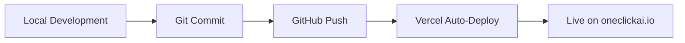
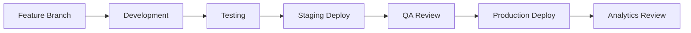

# OneClick AI Project Phases
## Complete Development, Production & Business Optimization Cycle

---

## 🚀 **PHASE 1: FOUNDATION & SETUP** 
*Status: ✅ COMPLETED*

### Development Environment
- [x] **Project Structure Setup**
  - Repository creation and initialization
  - Local development environment
  - Version control setup (Git/GitHub)
  - Basic file structure and organization

- [x] **Technology Stack Selection**
  - Frontend: HTML5, CSS3, JavaScript (Vanilla)
  - Hosting: Vercel with GitHub integration
  - Domain: oneclickai.io (GoDaddy registered)
  - Analytics: Google Analytics 4 ready
  - Email: Newsletter signup system

### Infrastructure Foundation
- [x] **Domain & DNS Configuration**
  - Domain registration and verification
  - DNS A-record configuration (76.76.21.21)
  - SSL certificate auto-provisioning via Vercel
  - CDN and edge network setup

- [x] **Deployment Pipeline**
  - GitHub repository integration
  - Vercel CLI deployment automation
  - Production domain connection
  - Automated build and deploy process

---

## 🎯 **PHASE 2: CORE DEVELOPMENT**
*Status: ✅ COMPLETED*

### Frontend Development
- [x] **Responsive Design Implementation**
  - Mobile-first responsive layout
  - Cross-browser compatibility
  - Modern UI/UX with gradient backgrounds
  - Professional typography and spacing

- [x] **Core Features Development**
  - AI tools showcase with 6 featured tools
  - Affiliate link tracking system
  - Email newsletter signup form
  - Navigation and user experience flow

### Content Management
- [x] **AI Tools Database**
  - ChatGPT Plus integration
  - Claude Pro affiliate setup
  - Zapier AI, Grammarly, GitHub Copilot, Notion AI
  - Pricing, ratings, and descriptions
  - Affiliate tracking URLs

- [x] **SEO Foundation**
  - Meta tags optimization
  - Sitemap.xml generation
  - Robots.txt configuration
  - Open Graph protocol setup

---

## 📊 **PHASE 3: PRODUCTION DEPLOYMENT**
*Status: ✅ COMPLETED*

### Production Launch
- [x] **Live Deployment**
  - Production environment setup
  - Domain connection and verification
  - SSL certificate validation
  - Performance optimization

- [x] **Quality Assurance**
  - Cross-device testing
  - Performance benchmarking
  - Security header implementation
  - Accessibility compliance check

### Monitoring Setup
- [x] **Analytics Integration**
  - Google Analytics 4 configuration
  - Event tracking for affiliate clicks
  - Email signup conversion tracking
  - User engagement metrics

---

## 🔄 **PHASE 4: BUSINESS OPTIMIZATION** 
*Status: 🟡 IN PROGRESS*

### Revenue Optimization
- [ ] **Affiliate Program Applications**
  - OpenAI Partner Program application
  - Notion Affiliate Program signup
  - Grammarly Business affiliate approval
  - Zapier Partner Program application
  - GitHub Sponsors integration

- [ ] **Conversion Optimization**
  - A/B testing implementation
  - Landing page optimization
  - Call-to-action improvements
  - User journey optimization

### Content Expansion
- [ ] **Content Strategy Implementation**
  - Weekly AI tool reviews
  - Productivity guides and tutorials
  - Comparison articles and rankings
  - Newsletter content automation

- [ ] **SEO Enhancement**
  - Keyword research and optimization
  - Content marketing strategy
  - Backlink building campaign
  - Local SEO implementation

---

## 📈 **PHASE 5: SCALING & GROWTH**
*Status: 🔲 PLANNED*

### Feature Expansion
- [ ] **Advanced Functionality**
  - AI tool comparison matrix
  - User accounts and preferences
  - Personalized recommendations
  - Advanced filtering and search

- [ ] **Monetization Diversification**
  - Premium subscription tier
  - Sponsored content integration
  - Digital product sales (guides, courses)
  - Consulting services offering

### Marketing Automation
- [ ] **Marketing Campaigns**
  - Google Ads campaign launch
  - Social media automation
  - Email marketing sequences
  - Influencer partnerships

- [ ] **Analytics & Optimization**
  - Advanced conversion tracking
  - Customer journey mapping
  - Revenue attribution modeling
  - Performance optimization

---

## 🔧 **PHASE 6: MAINTENANCE & ITERATION**
*Status: 🔲 ONGOING*

### Continuous Improvement
- [ ] **Regular Updates**
  - New AI tool additions (weekly)
  - Feature updates and improvements
  - Security patches and updates
  - Performance monitoring and optimization

- [ ] **Data-Driven Decisions**
  - Monthly analytics review
  - User feedback collection and analysis
  - Market research and trend analysis
  - Competitive analysis updates

### Business Intelligence
- [ ] **KPI Monitoring**
  - Revenue tracking and forecasting
  - Conversion rate optimization
  - Customer acquisition cost analysis
  - Lifetime value calculations

---

## 📊 **SUCCESS METRICS BY PHASE**

### Phase 1-3 Metrics (Completed)
- ✅ **Technical**: 100% uptime, <2s load time, mobile responsive
- ✅ **Deployment**: Live production site at https://oneclickai.io
- ✅ **Foundation**: SSL secure, SEO ready, analytics configured

### Phase 4 Target Metrics (Current)
- 📈 **Traffic**: 1,000+ monthly visitors
- 💰 **Revenue**: $500+ monthly affiliate commissions
- 📧 **Email**: 100+ newsletter subscribers
- 🎯 **Conversion**: 3%+ click-through rate on affiliate links

### Phase 5 Target Metrics (6 months)
- 📈 **Traffic**: 10,000+ monthly visitors
- 💰 **Revenue**: $5,000+ monthly recurring revenue
- 📧 **Email**: 1,000+ engaged subscribers
- 🎯 **Conversion**: 5%+ overall conversion rate

### Phase 6 Target Metrics (12 months)
- 📈 **Traffic**: 50,000+ monthly visitors
- 💰 **Revenue**: $25,000+ monthly recurring revenue
- 📧 **Email**: 10,000+ subscriber base
- 🎯 **Business**: Sustainable, profitable AI productivity hub

---

## 🛠️ **DEVELOPMENT WORKFLOW**

### Current Workflow (Established)

### Next Phase Workflow (Planned)

---

## 🎯 **IMMEDIATE NEXT STEPS**

### Week 1-2: Business Optimization Launch
1. **Apply to affiliate programs** (OpenAI, Notion, Grammarly, Zapier)
2. **Set up Google Analytics goals** for conversion tracking
3. **Create first newsletter** and email capture incentive
4. **Launch initial marketing campaigns** (Google Ads, social media)

### Month 1: Growth Foundation
1. **Publish 4 weekly AI tool reviews** with SEO optimization
2. **Build email subscriber base** to 100+ subscribers
3. **Optimize conversion funnel** based on analytics data
4. **Establish content creation rhythm** and publication schedule

---

*Last Updated: July 28, 2025*
*Current Phase: 4 - Business Optimization*
*Project Status: Production Live & Revenue Ready* 🚀